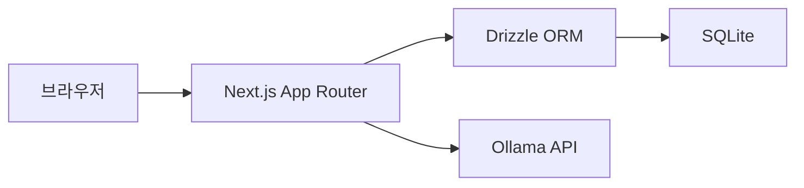

# 아키텍처

이 문서는 **현재 구현**만 설명한다. 목표 기능과 미구현 항목은
[제품 기준](./product.md)과 [로드맵](./roadmap.md)을 따른다.

## 구성

- Next.js 애플리케이션이 화면, Server Action, Route Handler를 함께 제공한다.
- Drizzle ORM이 단일 SQLite 파일을 읽고 쓴다.
- AI 생성은 서버에서 Ollama HTTP API를 호출한다.
- 운영에서는 Next.js를 standalone Docker 이미지의 단일 컨테이너로 실행한다.

정확한 패키지와 버전은 [`package.json`](../package.json), 데이터 필드는
[`src/db/schema.ts`](../src/db/schema.ts)가 기준이다.

## 코드 경계

| 경로 | 책임 |
| --- | --- |
| `src/app` | 라우트, 페이지 조합, Route Handler, 해당 화면 전용 Action/UI |
| `src/components` | 여러 라우트에서 재사용하는 UI |
| `src/features` | 도메인별 쿼리, 타입, 클라이언트 쿼리 키 |
| `src/db` | DB 연결과 Drizzle 스키마 |
| `src/app/api/generate-*` | 활성 일일·주간 Ollama 호출과 응답 처리 |
| `src/lib/ai.ts` | Server Action에서 사용하는 AI 호출 helper |
| `src/lib/dateUtils.ts` | 주간 범위와 KST 날짜 계산 |

App Router의 파일 규칙을 바꿀 때는 설치된 Next.js 문서
`node_modules/next/dist/docs/01-app/`를 먼저 확인한다.

## 주요 흐름

### 대상자 목록

1. `/` 서버 컴포넌트가 대상자 첫 페이지를 조회한다.
2. 클라이언트 목록이 API를 통해 다음 페이지를 무한 스크롤로 조회한다.
3. 대상자 등록은 Server Action으로 저장한 뒤 경로와 클라이언트 쿼리를 갱신한다.

### 일일 기록

1. `/recipients/[id]`가 대상자와 기간별 기록을 조회한다.
2. 사용자가 날짜와 관찰 메모를 입력한다.
3. `/api/generate-daily`가 Ollama 응답을 스트리밍한다.
4. 사용자가 확인한 결과를 `records` 테이블의 `daily` 레코드로 저장한다.

### 주간 기록

1. 선택한 주의 일일 기록을 조회한다.
2. `/api/generate-weekly`가 해당 월요일부터 7일간의 일일 기록을 Ollama에
   전달하고 작업 상태를 `PROCESSING`으로 저장한다.
3. 클라이언트가 레코드 상태를 polling하고, 생성이 끝나면 `COMPLETED` 결과를
   표시한다.

## 시간 기준

사용자 날짜는 `YYYY-MM-DD` 문자열이며 화면의 “오늘”은 KST
(`Asia/Seoul`)를 기준으로 한다. 주간 범위는 월요일부터 일요일까지다.
관련 계산의 원본은 `src/lib/dateUtils.ts`다.

## 런타임과 저장소

- 로컬 DB 위치는 `.env`의 `DATABASE_URL`이 정한다.
- 운영 DB는 호스트 `app_data`를 컨테이너 `/app/data`에 마운트한다.
- 운영 앱은 호스트의 Ollama를 `host.docker.internal`로 호출한다.
- Next.js standalone 출력 설정은 `next.config.ts`가 기준이다.
- Compose 포트, 볼륨, 환경변수는 `docker-compose.yml`이 기준이다.

## 아키텍처 결정

초기 운영은 개인 서버의 Docker + SQLite + Ollama 구성을 사용한다.

선택 이유:

- 웹, 데이터, AI를 한 서버에서 운영해 외부 의존성과 통신 경로를 줄인다.
- 소수 사용자의 초기 규모에서는 단일 SQLite와 단일 웹 컨테이너가 단순하다.
- Ollama와 DB를 공용 인터넷에 직접 공개하지 않을 수 있다.

제약:

- 서버 한 대가 단일 장애점이다.
- 웹 컨테이너를 수평 확장하지 않는다.
- 배포 중 짧은 연결 중단이 생길 수 있다.
- 인증이 완성되기 전에는 실제 개인정보를 입력하면 안 된다.
