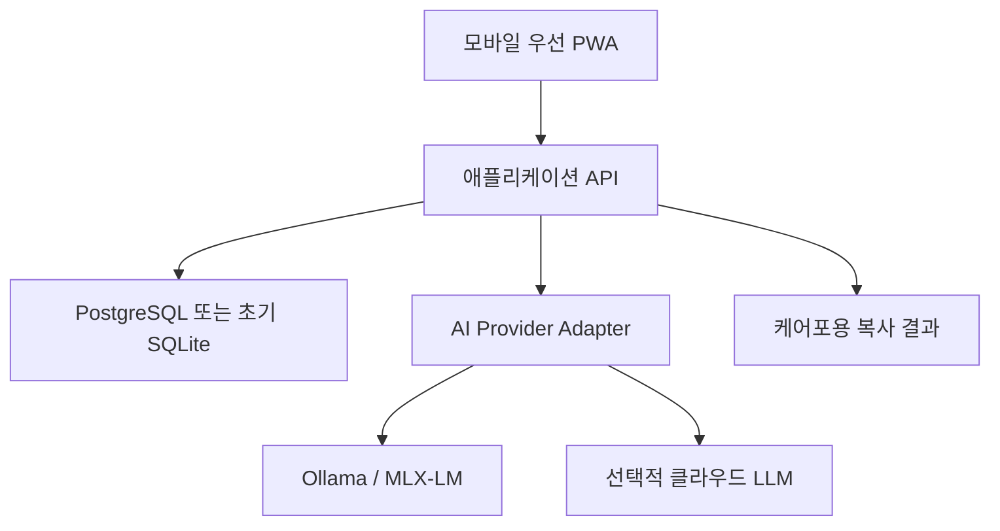

# 주야간보호 업무 일지 생성 서비스 설계

## 1. 제품 목표

요양보호사가 자유로운 프롬프트를 작성하지 않아도, 그날 관찰한 사실을 짧게
입력하면 다음 세 가지 기록의 초안을 생성한다.

1. 일일 행동 관련 기록
2. 일일 인지 관련 기록
3. 인지와 행동을 종합한 주간 기록

서비스의 핵심 가치는 자동 입력이 아니라 **짧은 사실을 빠뜨리거나 과장하지
않고 공식적인 기록 문장으로 바꾸는 것**이다.

### 제품 원칙

- 입력하지 않은 사실, 진단, 감정, 원인을 만들지 않는다.
- 기록자는 생성 결과를 확인하고 수정한 뒤 확정한다.
- 의학적 판단보다 관찰 가능한 행동과 그에 대한 요양보호사가 제공한 도움을 적는다.
- 문장에는 불필요한 미사여구를 배제하고 담담한 문장으로 작성한다.
- 문장의 예상 독자를 케어 대상자(노인)의 보호자(자식)로 가정한다.
- 서비스의 사용자는 IT 서비스에 익숙하지 않은 요양보호사이므로 행동을 예측 가능한 범위 안에서 통제하고 올바른 결과를 낼 수 있도록 유도한다.
- 실제 성함 등 식별정보는 AI 입력에서 가능한 한 분리한다.

## 2. 권장 MVP 범위

### 포함

- 대상자 선택
- 날짜별 관찰 메모 입력
- 키보드 입력 (음성 받아쓰기는 추후 지원)
- 자주 쓰는 사건을 버튼으로 선택
- 인지/행동 자동 분류 및 사용자의 분류 수정
- 일일 인지 기록과 행동 기록 생성
- 확정된 일일 기록을 이용한 주간 종합 기록 생성
- 결과 수정, 복사, 확정
- 생성 전 원문과 생성 후 문장의 변경 이력

### 처음에는 제외

- 케어포 계정 비밀번호 저장
- 케어포 화면에 대한 무인 자동 입력
- 진단, 위험도 판정, 치료 또는 투약 권고
- 보호자용 보고서 자동 발송
- 여러 기관을 위한 복잡한 결제 및 권한 체계

케어포 공개 소개에는 PC와 직원 앱의 요양급여 제공 기록, 상태변화 기록,
인지관리 기능이 안내되어 있지만 공개 API는 확인되지 않는다. 따라서 첫
버전은 `복사하기`까지 제공하고, 공식 연동 수단을 확인한 뒤 API 연동 또는
브라우저 확장을 별도 검토한다. 화면 좌표를 클릭하는 방식의 자동화는 UI
변경, 오입력, 계정 보안 문제 때문에 핵심 기능으로 삼지 않는다.

## 3. 어머니 중심 사용자 흐름

### 홈 화면

- 화면 상단: `오늘 기록`
- 중앙: 대상자 목록과 오늘 기록 상태
- 큰 버튼: `기록 시작`
- 상태 표시: `미작성`, `메모 있음`, `검토 필요`, `완료`

### 1단계: 대상자 선택

성함 대신 앱 내부 별칭 또는 센터 관리번호를 사용할 수 있다. 대상자 선택 후
오늘 날짜가 기본으로 지정된다.

### 2단계: 있었던 일 추가

한 사건을 한 카드로 입력한다.

| 입력 항목 | UI 방식 | 예시 |
| --- | --- | --- |
| 시간대 | 큰 선택 버튼 | 아침 |
| 사건 | 자주 쓰는 버튼 + 직접 입력 | 산책 |
| 관찰 내용 | 짧은 메모/음성 | 간식을 먹은 것을 기억하지 못함 |
| 제공한 도움 | 선택 사항 | 간식 섭취 사실을 다시 안내함 |
| 이후 반응 | 선택 사항 | 안내 후 이해함 |

자주 쓰는 사건 버튼 예:

- 식사
- 간식
- 산책
- 프로그램 참여
- 대화
- 휴식/수면
- 배회
- 거부
- 반복 질문
- 기억하지 못함
- 도움 요청
- 기분 변화
- 기타

메모는 여러 개를 연속으로 추가할 수 있다. 매 사건마다 인지/행동 분류 결과를
작은 태그로 보여 주고 한 번 눌러 바꿀 수 있게 한다.

### 3단계: 사실 확인

AI가 문장을 쓰기 전에 관찰 사실을 짧은 목록으로 보여 준다.

```text
아침
- 산책에 참여함
- 식사함
- 간식을 먹은 뒤 섭취 사실을 기억하지 못함
```

사용자는 `맞아요` 또는 각 항목의 `수정`만 누른다. 모호한 메모가 있으면
자유 질문 대신 선택형 질문을 최대 한 개만 제시한다.

```text
"간식을 먹은 것을 기억하지 못함" 이후에는 어땠나요?
[다시 안내함] [반복해서 물어봄] [별도 반응 없음] [모름]
```

### 4단계: 일일 기록 생성 및 확정

인지와 행동 결과를 서로 다른 카드로 보여 준다.

```text
[인지 관련 기록]
아침 간식 섭취 후 간식을 먹은 사실을 기억하지 못하는 모습을 보여
섭취 사실을 다시 안내함.

[행동 관련 기록]
아침 산책에 참여하였으며 식사를 하였음. 일상 활동에 전반적으로
참여하는 모습을 보임.
```

각 카드에는 다음 동작만 크게 제공한다.

- `수정`
- `다시 쓰기`
- `복사`
- `확정`

`다시 쓰기`는 프롬프트 입력창 대신 아래 선택지를 제공한다.

- 더 짧게
- 더 자연스럽게
- 사실만 간결하게
- 표현을 부드럽게

### 5단계: 주간 기록

주간 기록은 사용자가 새로 길게 입력하지 않는다. 해당 주에 확정된 일일
관찰 사실과 기록을 모아 다음을 보여 준다.

- 이번 주 반복 관찰
- 이전 주와 달라진 점
- 근거가 있는 인지/행동 종합 초안
- 기록이 부족한 날짜

변화 근거가 없으면 “호전”, “악화”, “유지”를 임의로 쓰지 않는다.

## 4. 기록 문체 규칙

### 권장 문체

- `~함`, `~보임`, `~안내함`, `~참여함` 형식
- 한 기록당 1~3문장
- 시간 순서 또는 관찰-지원-반응 순서
- 관찰 가능한 사실을 먼저 기술
- 지원이 입력된 경우에만 지원 내용을 기술

### 금지 또는 주의 표현

- 입력 근거 없는 진단: `치매가 심해짐`, `우울증으로 보임`
- 원인 단정: `관심을 받기 위해`, `고집이 세서`
- 가치 판단: `말을 안 들음`, `문제 행동을 함`
- 근거 없는 변화: `인지 기능이 악화됨`
- 입력하지 않은 조치: `정서적 지지를 제공함`, `안전을 확보함`
- 과장된 수식: `매우 적극적으로`, `눈에 띄게 호전됨`

### 예시 변환

입력:

```text
- 아침에 산책 감
- 밥 먹음
- 아침에 간식을 먹었으나 먹은 것을 기억하지 못함
```

일일 인지:

```text
아침 간식 섭취 후 간식을 먹은 사실을 기억하지 못하는 모습을 보임.
```

일일 행동:

```text
아침 산책에 참여하였으며 식사를 하였음.
```

주간 종합 예시:

```text
주간 동안 산책과 식사 등 일상 활동에 참여하였음. 간식 섭취 후
섭취 사실을 기억하지 못하는 모습이 관찰되었으며, 그 외 변화 여부는
현재 기록만으로 판단하기 어려움.
```

마지막 문장은 데이터가 한 번뿐인 상황에서 주간 추세를 꾸며내지 않기 위한
보수적 예시다. 실제 화면에서는 기록량이 부족한 경우 문장에 넣기보다
`추세 판단 자료 부족` 배지로 보여 주는 편이 더 자연스럽다.

## 5. AI 처리 파이프라인

자유 메모를 한 번의 프롬프트로 곧바로 최종 문장으로 바꾸지 않는다.


### 5.1 사실 구조화

모델은 먼저 자연어를 아래 JSON으로만 변환한다.

```json
{
  "observations": [
    {
      "time_of_day": "morning",
      "event": "snack",
      "observed_fact": "간식을 먹은 뒤 섭취 사실을 기억하지 못함",
      "assistance": null,
      "response": null,
      "domains": ["cognition"],
      "uncertain": false
    }
  ]
}
```

모델이 입력에 없는 `assistance`나 `response`를 채우면 검증에서 실패시킨다.

### 5.2 분류

초기 분류 규칙:

- 인지: 기억, 지남력, 이해, 판단, 의사소통, 반복 질문, 사람/장소 혼동
- 행동: 참여, 거부, 배회, 초조, 공격, 수면, 식사 행동, 대인 상호작용
- 둘 다: 인지 상태가 행동으로 이어진 사건
- 일반 활동: 산책, 식사처럼 상태 평가가 아닌 단순 활동

일반 활동은 행동 기록에 포함할 수 있지만 “행동 이상”으로 해석하지 않는다.

### 5.3 문장 생성

생성 요청에는 원문 전체가 아니라 사용자가 확인한 구조화 사실만 전달한다.
출력은 다음 스키마로 제한한다.

```json
{
  "cognition_daily": "string | null",
  "behavior_daily": "string | null",
  "warnings": ["string"]
}
```

시스템 지침의 핵심:

```text
당신은 주야간보호센터 관찰 기록의 초안을 작성한다.
제공된 사실만 사용한다. 진단, 원인, 감정, 조치, 변화 정도를 추측하지 않는다.
인지 기록과 행동 기록을 구분한다.
격식을 갖추되 과장하지 않고 '~함/~보임' 문체로 1~3문장을 작성한다.
근거가 부족하면 내용을 만들지 말고 warnings에 표시한다.
```

### 5.4 검증

생성 후 별도 검증 단계에서 다음을 확인한다.

- 문장의 모든 주장에 대응하는 입력 사실이 있는가
- 인지와 행동 영역이 잘못 섞이지 않았는가
- 진단, 비난, 과장, 근거 없는 조치가 추가되지 않았는가
- 날짜와 대상자가 섞이지 않았는가
- 주간 기록의 반복성/변화 표현에 2개 이상의 근거가 있는가

검증 실패 시 사용자에게 잘못된 문장을 보여 주지 않고 더 보수적인 설정으로
한 번만 재생성한다. 다시 실패하면 사실 목록을 문장 템플릿으로 연결한
비 AI 결과를 제공한다.

## 6. 데이터 모델

### Recipient

```text
id
display_code         # 앱 내부 별칭 또는 센터 관리번호
encrypted_name       # 꼭 필요한 경우에만 저장
active
created_at
```

### Observation

```text
id
recipient_id
observed_at
time_of_day
raw_note
event_type
observed_fact
assistance
response
domains[]            # cognition, behavior, general
created_by
confirmed_at
```

### GeneratedRecord

```text
id
recipient_id
period_type          # daily, weekly
period_start
domain               # cognition, behavior, combined
source_observation_ids[]
generated_text
final_text
status               # draft, reviewed, finalized
model_id
prompt_version
validation_result
created_by
finalized_at
```

### AuditEvent

```text
id
actor_id
action
entity_type
entity_id
metadata             # 실제 기록 본문은 남기지 않는 것을 기본값으로 함
created_at
```

주간 기록은 확정된 일일 문장만 재요약하기보다 원래의 확정된 관찰 사실을
근거로 생성한다. 문장을 다시 요약하면 작은 추측이 누적될 수 있기 때문이다.

## 7. 기술 아키텍처

### 권장 구성



### 구현 선택

- 프론트엔드: Next.js + TypeScript, 모바일 우선 PWA
- 백엔드: Next.js Route Handler 또는 별도 FastAPI
- DB: 1인 MVP는 SQLite, 기관 확장은 PostgreSQL
- 인증: 패스키 또는 간단한 계정 + 기기 등록
- 로컬 추론 1차: Ollama
- Apple Silicon 성능 최적화가 필요할 때: MLX-LM
- 원격 접속: Tailscale 같은 사설망 또는 인증된 HTTPS 프록시

초기에는 단일 Next.js 애플리케이션과 SQLite로도 충분하다. AI 호출은 반드시
아래와 같은 공급자 인터페이스 뒤에 둔다.

```ts
interface RecordGenerator {
  structure(input: StructureInput): Promise<StructuredObservation[]>;
  generateDaily(input: DailyInput): Promise<DailyDraft>;
  generateWeekly(input: WeeklyInput): Promise<WeeklyDraft>;
  validate(input: ValidationInput): Promise<ValidationResult>;
}
```

이 구조면 Ollama에서 클라우드 모델로 바꾸거나, 품질 비교를 위해 두 모델을
병행해도 화면과 업무 로직을 수정하지 않아도 된다.

## 8. 로컬 LLM 적용 가능성

### 결론

Mac Studio M4 Max, 통합 메모리 64GB는 이 서비스의 단일 사용자 또는 소수
사용자 추론 서버로 충분하다. 작업이 짧은 한국어 문장 생성이므로 거대한
모델이나 긴 문맥이 필요하지 않다.

권장 실험 순서:

1. 14B급 4-bit 모델로 UX와 전체 파이프라인 검증
2. 한국어 문체나 사실 충실도가 부족하면 27B~30B급 4-bit 모델 비교
3. 실제 교정 데이터가 쌓인 뒤 프롬프트 예시 또는 LoRA 미세조정 검토

후보 예:

- Qwen3 14B: 빠른 1차 후보
- Qwen3 30B-A3B Instruct 계열: 총 30B지만 활성 파라미터가 작은 MoE 후보
- Gemma 3 27B IT: 비교 평가용 후보

4-bit 27B~30B 모델은 형식에 따라 대략 16~22GB 수준의 모델 메모리에 실행
오버헤드와 KV 캐시가 더 필요하므로 64GB 장비에서 여유가 있다. 70B급 4-bit도
조건에 따라 메모리에 들어갈 수 있지만 운영체제와 캐시 여유가 줄고 이 짧은
업무에는 비용 대비 이점이 작다.

### Ollama와 MLX-LM 선택

| 항목 | Ollama | MLX-LM |
| --- | --- | --- |
| 초기 개발 | 매우 쉬움 | Python 구성 필요 |
| 로컬 API | 기본 제공 | 직접 서버 구성 가능 |
| 모델 교체 | 쉬움 | 쉬움 |
| Apple Silicon 최적화 제어 | 보통 | 높음 |
| 미세조정 | 별도 도구 필요 | LoRA/전체 미세조정 지원 |
| 추천 시점 | MVP | 성능 최적화/실험 |

Ollama는 설치 후 기본 로컬 API를 제공하므로 MVP에 적합하다. 다만
`localhost:11434`를 인터넷에 직접 공개하지 않고 애플리케이션 백엔드만
접근하게 해야 한다. MLX-LM은 Apple Silicon에서 생성, 양자화, LoRA
미세조정을 지원하므로 이후 최적화 경로로 적합하다.

### 로컬 모델의 한계

- 한국어가 자연스러워도 기록 관행에 맞는다는 보장은 없다.
- 작은 모델은 원문에 없는 도움이나 반응을 상투적으로 덧붙일 수 있다.
- 모델 교체만으로 품질이 보장되지 않으며 검증 규칙과 테스트셋이 더 중요하다.
- Mac 재부팅, 모델 로딩, 원격 접속 장애에 대한 운영 장치가 필요하다.

따라서 “로컬이라 안전하다”와 “기록이 정확하다”를 별개로 검증해야 한다.

## 9. 개인정보 및 운영 보안

대상자의 인지 및 행동 기록은 민감한 돌봄 정보다. 실제 운영 전에 센터의
개인정보 처리 책임자와 저장·위탁·보유 기준을 확인해야 한다.

최소 기준:

- AI 요청에는 실명, 생년월일, 주소, 보호자 연락처를 넣지 않는다.
- 대상자는 무작위 내부 ID로 연결한다.
- 전송 구간은 HTTPS 또는 사설망으로 보호한다.
- DB 백업과 기기 저장소를 암호화한다.
- 원문과 확정 기록의 보유 기간을 정하고 자동 삭제한다.
- 모델 프롬프트와 응답을 일반 애플리케이션 로그에 남기지 않는다.
- 관리자라도 업무상 필요한 대상자만 볼 수 있게 한다.
- 생성 결과에는 `AI 초안` 표시를 하고 확정자를 기록한다.
- 케어포 비밀번호를 이 서비스에 저장하지 않는다.
- 외부 LLM을 쓸 때는 실제 정보를 가명 처리하고 계약 및 데이터 보관 정책을
  별도로 검토한다.

로컬 서버는 인터넷에 포트를 직접 여는 대신, 어머니의 휴대폰만 허용하는
사설망과 애플리케이션 인증을 함께 쓰는 구성이 안전하다.

## 10. 품질 평가

모델 선택 전에 실제 업무 문체로 작은 골든 데이터셋을 만든다.

### 초기 데이터셋

- 실제 식별정보를 제거한 관찰 메모 50~100건
- 어머니 또는 숙련자가 직접 고친 정답 문장
- 인지, 행동, 둘 다, 분류 불가 사례
- 정보가 부족해 문장을 만들면 안 되는 사례

### 합격 기준

- 사실 추가율: 0% 목표
- 대상자/날짜 혼동: 0건
- 금지 표현 사용: 0건
- 영역 분류 정확도: 95% 이상
- 생성 후 그대로 확정한 비율: 70% 이상부터 실용적
- 평균 수정 글자 수: 지속 감소
- 모바일에서 메모 시작부터 복사까지: 60초 이내
- 로컬 생성 응답: 체감상 5초 이내 목표

어머니의 수정 내용을 다음 생성의 원문에 무조건 학습시키지 않는다. 먼저
어떤 표현을 자주 고치는지 통계로 모으고, 문체 규칙과 예시를 갱신한 뒤
검증셋으로 회귀 테스트한다.

## 11. API 초안

```text
POST   /api/observations/structure
POST   /api/observations
GET    /api/recipients/:id/days/:date
POST   /api/records/daily/generate
PATCH  /api/records/:id
POST   /api/records/:id/finalize
POST   /api/records/weekly/generate
GET    /api/records/:id/evidence
```

일일 생성 요청:

```json
{
  "recipientId": "rec_01",
  "date": "2026-06-13",
  "observationIds": ["obs_01", "obs_02", "obs_03"]
}
```

응답:

```json
{
  "cognition": {
    "text": "아침 간식 섭취 후 간식을 먹은 사실을 기억하지 못하는 모습을 보임.",
    "evidenceIds": ["obs_03"]
  },
  "behavior": {
    "text": "아침 산책에 참여하였으며 식사를 하였음.",
    "evidenceIds": ["obs_01", "obs_02"]
  },
  "warnings": []
}
```

결과마다 `evidenceIds`를 반환하면 사용자가 문장을 눌렀을 때 근거 메모를
바로 확인할 수 있다.

## 12. 개발 단계

### 0단계: 문체 발견

- 어머니가 실제로 작성한 익명화 기록 20~30개 수집
- 좋은 문장과 자주 고치는 표현 정리
- 케어포 각 입력란의 글자 수와 필수 형식 확인

### 1단계: 1인용 MVP

- 대상자, 날짜, 사건 카드 입력
- 일일 인지/행동 생성
- 수정, 확정, 복사
- Ollama 연동
- 생성 근거 표시와 감사 로그

### 2단계: 주간 기록

- 확정 관찰을 이용한 주간 종합
- 반복 사건과 변화 근거 표시
- 기록 누락 알림

### 3단계: 사용성 개선

- 휴대폰 음성 받아쓰기
- 자주 쓰는 사건 개인화
- 큰 글씨/고대비 모드
- 오프라인 임시 저장과 네트워크 복구

### 4단계: 제한적 연동

- 케어포에 공식 API 또는 허용된 연동 방식 문의
- 가능하면 공식 API 사용
- 공식 API가 없으면 사용자 조작을 보조하는 브라우저 확장을 별도 보안 검토
- 자동 제출 전에는 항상 대상자, 날짜, 문장을 다시 확인

## 13. 가장 먼저 검증할 질문

1. 케어포의 실제 세 입력란 성함, 글자 수, 작성 주기는 정확히 무엇인가?
2. 인지 기록과 행동 기록에 센터가 요구하는 고정 문체가 있는가?
3. 어머니는 근무 중 휴대폰, 태블릿, PC 중 무엇을 가장 편하게 쓰는가?
4. 한 명당 하루 평균 사건 수와 담당 대상자 수는 몇 명인가?
5. 주간 종합의 기준 요일과 대상 기간은 어떻게 계산하는가?
6. 성함 대신 관리번호를 사용해도 업무 흐름에 문제가 없는가?
7. 센터가 외부 또는 개인 소유 서버에 업무 정보를 저장하는 것을 허용하는가?

이 질문의 답이 정해지기 전에도 1인용 프로토타입은 만들 수 있지만, 실제
업무 투입과 케어포 연동은 답을 확인한 뒤 진행해야 한다.

## 참고 자료

- 케어포 주야간보호급여 주요 프로그램 구성:
  https://www.carefor.co.kr/daycare/func.php
- Ollama API 문서:
  https://docs.ollama.com/api/introduction
- MLX-LM:
  https://github.com/ml-explore/mlx-lm
- Qwen3 30B-A3B Instruct 모델 카드:
  https://huggingface.co/Qwen/Qwen3-30B-A3B-Instruct-2507
- Gemma 3 27B IT 모델 카드:
  https://huggingface.co/google/gemma-3-27b-it
- 개인정보보호위원회:
  https://www.pipc.go.kr/
